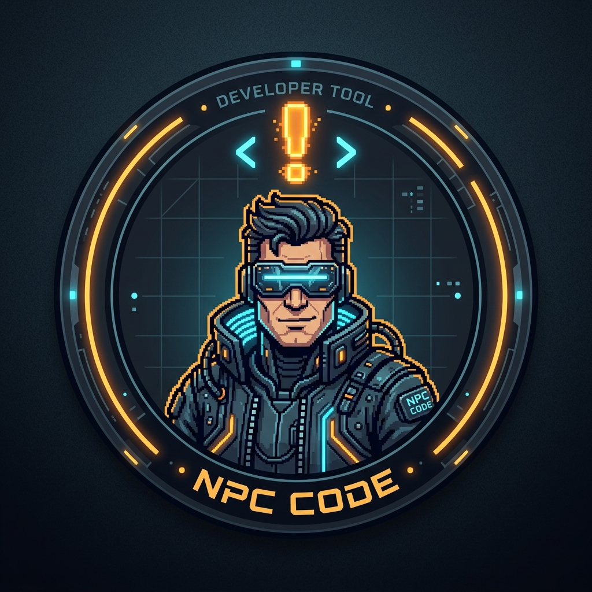

# NPC Code Assistant (`npc-vscode`)

<p align="center">
  
</p>

> Enterprise AI coding assistant powered by **NPC Core** with seamless BYOM (Bring Your Own Model) support for Ollama, DeepSeek, OpenAI, Anthropic, and custom OpenAI-compatible endpoints.

---

## Key Features

| Feature | Description |
|---|---|
| **NPC Core Engine** | Powered by unified reasoning, tool execution, session management, and durable task boards |
| **Isolated Git Worktrees** | Ephemeral, zero-conflict git worktrees for isolated subagent execution and safe branch merge-backs |
| **Switchyard Multi-Model Routing** | Automated complexity-based model routing between fast and high-reasoning models with prefix KV-cache preservation |
| **Model Safety Guardrails** | Granular execution policies across 5 tiers (`config`, `allow`, `ask`, `ask_every_time`, `deny`) with command pre-evaluation |
| **Tail Personalization** | Developer conventions appended at prompt tail to maintain 100% KV-cache prefix hit rates |
| **AST-Aware Code Search (Semble)** | Syntax-aware code chunking (functions, classes, methods) with ripgrep fallback |
| **Background Task Manager** | Detached process execution, log streaming, process-tree termination, and stdin pipe interaction |
| **Artifact Management System** | First-class markdown artifact generation, diff inspection, and persistence in `.npc/artifacts` |
| **Bring Your Own Model (BYOM)** | Native support for local Ollama auto-discovery, DeepSeek, OpenAI, OpenRouter, and any OpenAI-compatible endpoint |
| **Retro Ergonomic UI** | Amber phosphor CRT terminal aesthetic with glowing HUD elements and eye-strain-free overlay |
| **Docx & Document Viewing** | Native parsing and markdown conversion of `.docx` documents directly inside the chat interface |
| **Reasoning / Thinking Models** | Native reasoning token streaming (Qwen, DeepSeek R1, vLLM) and configurable thinking effort |
| **Context Compaction & Cost Gate** | Intelligent compaction with SoL-Pi KV-cache cost gating and atomic tool action fusion (`then_run`) |
| **Decoupled Test & Repair (ExecCritic)** | Fail-closed reproduction test qualification with tamper-proof test freezing |
| **Turn Routing Telemetry (NeoHorse-1)** | Per-turn routing decision logging and curriculum feedback scoring |
| **Regularized Self-Improvement (RRSI)** | Annealed proposal budgets, leakage screening, and complexity-gated harness optimization |
| **Procedural Graphs** | Directed `(procedure, relation, procedure)` execution graphs with self-evolving failure repairs |
| **Harness Distillation (Harness-Zero)** | Boundary teacher interception generating clean SFT demonstration pairs without prompt leakage |
| **Private & Telemetry-Free** | Telemetry attribution headers are opt-in and disabled by default |

---

## Quick Start

### 1. Model Configuration

Local Ollama models are discovered automatically on startup.
To add a remote or local custom model, open Command Palette (`Ctrl+Shift+P` / `F1`) and execute:

```text
NPC: Add Custom Provider / Model
```

Follow the prompts or configure directly in VS Code `settings.json`:

```json
{
  "pi.customModels": [
    {
      "id": "deepseek-chat",
      "name": "DeepSeek V3",
      "baseUrl": "https://api.deepseek.com/v1",
      "apiKey": "your-api-key"
    },
    {
      "id": "qwen3.5:9b",
      "name": "Qwen 3.5 9B",
      "baseUrl": "http://localhost:11434/v1",
      "apiKey": "ollama",
      "isOllama": true
    }
  ]
}
```

### 2. Using NPC Code in VS Code

1. Open the **NPC Assistant** sidebar (`$(sparkle) NPC` on the Activity Bar).
2. Select your desired model from the model dropdown.
3. Chat, edit files, or manage tasks on the NPC Task Board.

---

## Terminal Coding Agent (`npc`)

To use the standalone terminal agent alongside VS Code:

```bash
# Launch interactive terminal session
npc

# Run a one-off prompt
npc -p "Explain the architecture of this project"
```

---

## License

MIT
